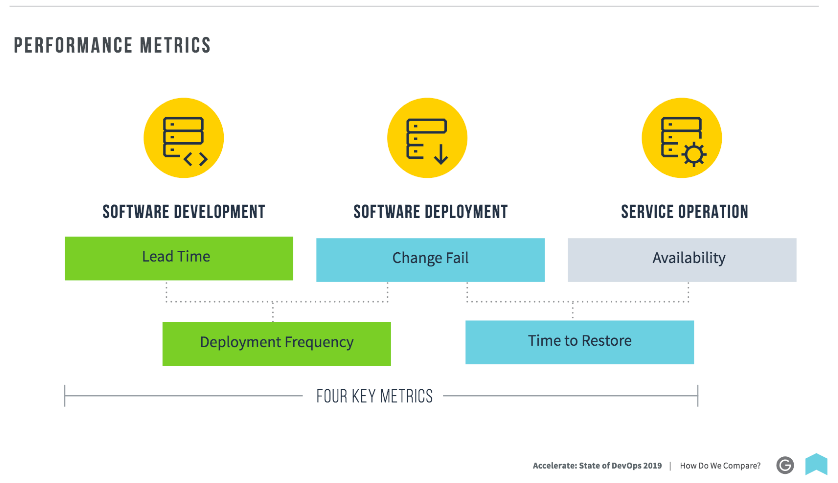

# Measuring performance

__A successful measure of performance should have two key characteristics:__
  1. It should focus on global outcome to ensure teams aren't pitted against each other. 
      The classic example is rewarding developers for throughput and operations for stability. 
This is a key contributor to the "wall of confusion" in which development throws poor quality code over the wall to operations 
and the operations put in place painful change management process as a way to inhibit change.
  
  2. Measure should focus on outcomes not output. 
    It shouldn't reward people for putting in large amounts of busy work that doesn't actually help achieving organizational goal. 

## 4 PERFORMANCE METRICS

The first four metrics that capture the effectiveness of the development and delivery process can be summarized in terms of throughput and stability. The study measure the throughput of the software delivery process using __lead time__ of code changes from check-in
to release along with __deployment frequency__. Stability is measured using __time to restore__— the time it takes from detecting a user- impacting incident to having it remediated— and __change fail rate__, a measure of the quality of the release process.

### SOFTWARE DEVELOPMENT

#### Lead time

Lead time is the time it takes to go from a customer making a request to the request being satisfied. 
The elevation of lead time as a metric is a key element of the __Lean__ theory.

#### Deployment frequency

How often does an organization deploy code to production or release it to end users.

### SOFTWARE DEPLOYMENT

### Time to restore

How long does it generally take to restore service when a service incident or a defect that impacts users occurs (e.g., unplanned outage or service impairment)

### Change fail rate

For the primary application or service you work on, what percentage of changes to production or released to users result in degraded service (e.g., lead to service impairment or service outage) and subsequently require remediation (e.g., require a hotfix, rollback,
fix forward, patch)?

## High performers vs low performes

#### When compared to low performers the high performers have (2018): 
  - 46 times more frequent code of deployments 
  - 440 times faster lead time from commit to deploy 
  - 170 times faster mean time to recover from downtime 
  - 5 times slower change failure rate (1/5 as likely for a change to fail)
  
#### When compared to low performers the high performers have (2019): 
  - 208 times more frequent deploy frequency
  - 106 times faster lead time from commit to deploy 
  - 2604 times faster mean time to restore service
  - 7 times Lower Change Fail Rate
  
Source: [state-of-devops-2019](https://github.com/gramland/devops-culture/blob/master/accelerate/pdfs/state-of-devops-2019.pdf)

