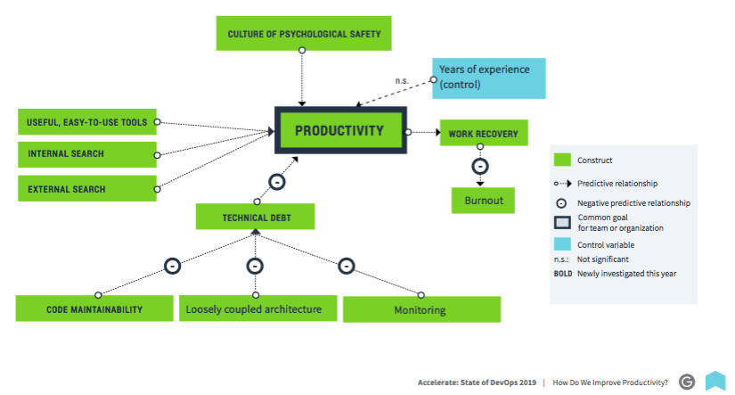

## Measuring productivity

Productivity is the ability to get complex, time-consuming tasks completed with minimal distractions and interruptions.

   

Measuring productivity in terms of line of code has a long history in software. If you are still doing it __stop now__ (really).
Some companies even require developers to record the lines of code committed per week.
However in reality we would prefer a 10 line solution to a 1000 line solution to a problem.

Rewarding developers for writing lines of code leads to bloated software that incurs in higher maintenance cost and 
higher cost of change. Ideally we should reward developers for solving business problems with a minimum amount of code and it's even
better if we can solve the problem without writing code at all or deleting code or perhaps by a business process change.

Other metrics are often just a way to shift or mask the same problem. 
Measuring quantities that are not statistically correlated with team and organizational perfomance.
Productivity cannot be captured with a simple metric such as lines of code, story points, or bugs closed; doing so results in unintended consequences that sacrifice the overall goals of the team. 
For example, teams may refuse to help others because it would negatively impact their velocity, even if their help is important to achieve organizational goals.

See [performance](performance.md)
